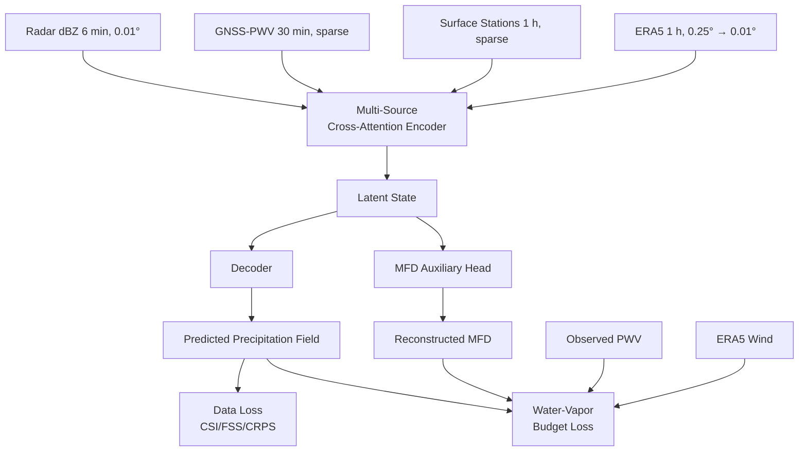

<div align="center">
  

  <h1 style="margin-top: 20px; font-size: 3em; color: #2c3e50;">Pluvian</h1>
  <p style="font-size: 1.2em; color: #7f8c8d; margin-bottom: 30px;">
    <strong>Physics-Driven Multi-Source AI for Precipitation Nowcasting</strong>
  </p>

  [](https://www.python.org/downloads/)
  [](https://pytorch.org/)
  [](LICENSE)
  [](#)

  <br/>

  [Motivation](#-motivation) • [Data](#-data-resources) • [Architecture](#-architecture) • [Pipeline](#-pipeline) • [Roadmap](#-roadmap)

</div>

---

## Introduction

**Pluvian** is a research codebase for **physics-driven AI nowcasting of extreme precipitation** in North China. It fuses ground-based radar reflectivity, GNSS-derived precipitable water vapor (PWV), surface meteorological observations, and ERA5 reanalysis into a single multi-source learning framework, and uses the **column water-vapor budget** as a soft physical constraint on the predicted rainfall field.

The work centers on the **"23·7" Beijing–Tianjin–Hebei extreme rainfall event** (29 July – 1 August 2023) as its flagship case study — the most severe summer storm in North China since 1883.

---

## Motivation

<table>
<tr>
<td width="50%">

### Multi-Source Physics
Combine radar (6 min / 0.01°), GNSS-PWV (216 stations), surface stations (389), and ERA5 (8 pressure levels) in one model — instead of the radar-only approach used by most existing nowcasters.

### Water-Vapor Budget Loss
Enforce <code>∂PWV/∂t + ∇·(qV) ≈ −P + E</code> as a soft loss term so the predicted precipitation is consistent with observed moisture supply.

</td>
<td width="50%">

### Moisture Flux Divergence Channel
Reconstruct MFD fields from ERA5 + GNSS-PWV gradients and feed them as an explicit physical input channel, not just raw u/v winds.

### Counterfactual Interpretability
Use PWV-replacement counterfactuals (instead of vanilla SHAP) to verify the model has truly learned moisture–rainfall causality.

</td>
</tr>
</table>

---

## Data Resources

```
/Data/tanh/npj/
├── radar_nc/         24,144 .nc files — 6 min / 0.01°, composite reflectivity (dBZ)
│                     Coverage: 113–120°E, 36–42.6°N, 2023-05 to 2023-09 (101 raining days)
├── pwv/              216 GNSS stations × 30-min PWV (Feb–Aug 2023)
│                     176 usable stations after quality control
├── stations/         389 surface stations × 1-hour
│                     PRS, WIN_D, WIN_S, TEM, RHU, PRE_1h
├── era5/             ERA5 pressure-level reanalysis
│                     u, v, q, T × 8 levels (925–250 hPa) × 5 months × 1 h
├── derived/
│   ├── mfd/          Moisture flux divergence (3 levels × 5 months, pre-computed)
│   └── instability/  CAPE / CIN / K-index / LCL / SI / TT (6 indices × 5 months)
└── figures/case_23p7/ Physical diagnostic figures for the 23·7 case (6 publication-ready)
```

**Time window**: Triple-source overlap = 2023-05-01 → 2023-08-31, 87 radar days + 16 zero-rain days = **103-day training pool**. 4-day held-out validation (23·7 event). 14-day September robustness test (PWV-ablation).

---

## Architecture



Three novelty pillars (each ablated separately):
- **I-1** Water-vapor budget loss as soft physical constraint
- **I-2** GNSS-network-reconstructed MFD as an explicit input channel
- **I-3** Sparse-to-dense cross-attention fusion across radar, PWV, surface, and ERA5

---

## Pipeline

```
pipeline/
├── data_loader.py           NPJDataset (PyTorch) — 6 min × 0.01° aligned tensors
├── radar_io.py              dBZ decode + Z–R inversion (Z = 300 R^1.4)
├── pwv_io.py                GNSS PWV + coordinate fix + mask generation
├── station_io.py            Surface 6-variable loader
├── era5_io.py               8-level ERA5 with on-the-fly bilinear interpolation
├── utils.py                 dbz_to_rainrate, masking, spatial interp
├── build_manifest.py        Train / val / test_robust split
├── compute_mfd.py           Pre-compute MFD fields (15 NetCDF)
├── compute_instability.py   Pre-compute CAPE/CIN/K/LCL/SI/TT (30 NetCDF)
└── test_loader.py           End-to-end smoke test with assertions
```

All four data sources are aligned to the radar 6-min × 0.01° grid; sparse PWV / station data are kept as point tokens with explicit mask channels for cross-attention fusion.

---

## Case Study: 2023 "23·7" Beijing–Tianjin–Hebei Extreme Rainfall

The pipeline ships with a full physical-diagnostic case study of the most damaging summer storm in North China in 140 years:

- **Cumulative rainfall**: 1003 mm at Wangjiayuan reservoir (Linchang, Hebei)
- **Driving factors**: Typhoon Doksuri remnant + dual high-pressure block + Khanun secondary uplift + Taihang mountain orography
- **Operational forecast skill**: 50–70 % under-estimation of peak rainfall by ECMWF / CMA-MESO / GFS

Six publication-grade diagnostic figures are pre-rendered in [`figures/case_23p7/`](figures/case_23p7/) with a narrative document explaining the four-stage causal chain
**PWV accumulation → MFD convergence → CAPE release → rainfall outburst**.

---

## Project Status

| Stage | Status |
|---|---|
| Data audit & handling spec | ✅ Done (`DATA_HANDLING.md`) |
| Literature & innovation scoping | ✅ Done (`RESEARCH_PROPOSAL_v1.md`) |
| Unified data loader (T1) | ✅ Passed audit |
| MFD computation (T2) | ✅ 15 files, passed audit |
| Instability indices (T3) | ✅ 30 files, passed audit |
| 23·7 case study figures (T4) | ✅ 6 figures, passed audit |
| Model architecture (Phase 4) | ⏳ Next |
| Training & ablation (Phase 5) | ⏳ Planned |
| 23·7 head-to-head vs ECMWF / Pangu (Phase 6) | ⏳ Planned |
| Paper drafting | ⏳ Planned |

---

## Roadmap

- **Phase 4 — Model**: Implement the cross-attention multi-source encoder with the water-vapor budget loss head. Start from a Swin / AFNO backbone for the radar branch and a Perceiver-style latent for sparse tokens.
- **Phase 5 — Training & Ablation**: 6 ablation runs — no PWV / PWV-concat only / PWV-channel only / +MFD channel / +water-budget loss / full Pluvian — on 103-day training pool, 23·7 hold-out validation.
- **Phase 6 — Comparison & Interpretability**: Head-to-head vs ECMWF IFS, CMA-MESO, Pangu-Weather, GraphCast on the 23·7 case. PWV counterfactual attribution to verify learned causality.
- **Submission target**: npj Climate and Atmospheric Science.

---

## Documentation

- [`DATA_HANDLING.md`](DATA_HANDLING.md) — Complete data processing specification with rationale
- [`RESEARCH_PROPOSAL_v1.md`](RESEARCH_PROPOSAL_v1.md) — Background literature review, candidate innovations, and paper narrative
- [`figures/case_23p7/narrative.md`](figures/case_23p7/narrative.md) — Physical interpretation of the 23·7 diagnostic figures
- [`audit/`](audit/) — Independent QA reports for each pipeline stage

---

## License

MIT
